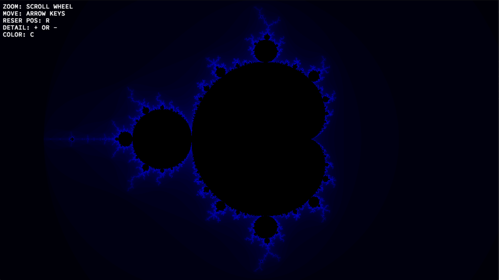

# Fractol

A fractal renderer it includes:

* Julia
* Mandelbrot
* Tricorn\

## Usage

Compile the program by: `Make`\
Run the program by: `./fractol <name of fractol>`

## Requirements

  1. C compiler
  2. Make
  3. X11

## Controls

* Zoom: `scroll wheel`
* Move: `Arrow keys`
* Reset: `R`
* Increase Detail: `+`
* Decrease Detail: `-`
* Cycle Color: `C`

## Screen resolution

You can tweak the resolution by editing:\
`# define WINDOW_X`\
`# define WINDOW_Y`\
Present in `fractol.h`
